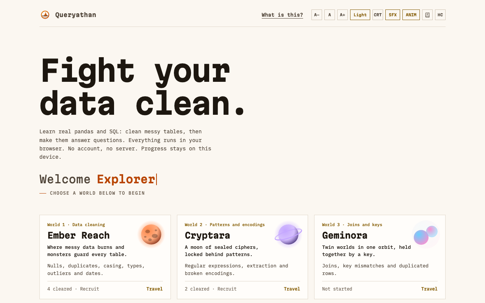
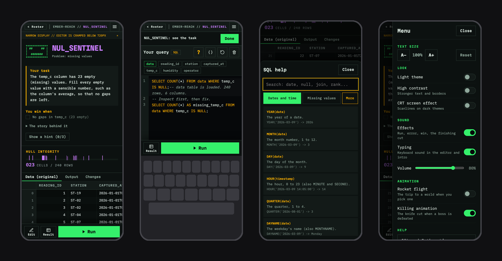

<div align="center">


# Queryathan

**Slay messy data. Learn real pandas and SQL by playing.**
Nine planet worlds, 45 hands-on cases, real Python and SQLite running in your browser.
No account. No server. Works offline.

[](https://github.com/Yuvakunaal/queryathan/actions/workflows/ci.yml)
[](./LICENSE)
[](./CONTRIBUTING.md)
[](https://github.com/Yuvakunaal/queryathan/labels/good%20first%20issue)


[Quick start](#-quick-start) · [The nine worlds](#-the-nine-worlds) · [How it works](#-how-it-works) · [Contribute](#-contributing) · [FAQ](#-faq)

<!-- After you deploy, add the live link here: **[Play now](https://your-domain)** -->

</div>

<p align="center">
  
  
</p>

## ✨ What is Queryathan?

_Queryathan_ is _query_ + _leviathan_: the great beast of messy data, and the queries you fight it with.

Most people learn data work from tidy tutorials, then meet a real table and freeze. Queryathan flips that: every case is a **messy table with a real problem in it**, and you fix it by writing **real pandas or real SQL**, running it against a **real engine in your browser**, and watching the table change. Win a case and a short cinematic plays. Travel to the next world by rocket.

- 🐍 **Real engines, not simulations.** Python runs in [Pyodide](https://pyodide.org) (pandas compiled to WebAssembly) and SQL in [sql.js](https://sql.js.org) (SQLite). The errors are the real errors, with a plain-English explanation on top.
- 🔀 **Every case works in both languages.** The same problem, solved with pandas or with SQL. The tests prove each case is winnable in both, and that the starter code does not already win.
- 🎯 **Judged by the result.** A case is won by clean cells or an exact answer table, never by matching your code, so any correct approach wins.
- 🔒 **No backend, no account, nothing uploaded.** Your progress, code and files stay in your browser (progress exports as a file), and after one visit it works offline. The hosted site only counts anonymous page views (cookieless); see [Privacy](#-faq).
- ⚡ **Quick to open.** The home page is one small script (103 kB gzipped). The editor, the engines and your CSV reading load only when needed, and Python starts only when you point at it. See [Performance](#-performance).
- 📱 **Phone-first, too.** Below 720 px every option lives in a right-hand menu drawer, typing lifts the editor above the keyboard, a pinned dock keeps Run, Edit and Result one tap away, and the intro says "tap anywhere" because there is no Enter key. Desktop and tablet keep the full layout.
- ♿ **Accessible.** Dark, light and high-contrast themes, adjustable text size, full keyboard use, reduced-motion support, and WCAG audits in CI.
- 🚀 **Cinematic, and optional.** A rocket flight between worlds and a knife-cut win scene, each switched on or off in the **ANIM** menu.
- 🧰 **Open content.** A case is one JSON file and a CC0 dataset. Adding one needs no engine knowledge.

<details>
<summary><b>Table of contents</b></summary>

- [Quick start](#-quick-start)
- [The nine worlds](#-the-nine-worlds)
- [Screenshots](#-screenshots)
- [On a phone](#-on-a-phone)
- [Why it is different](#-why-it-is-different)
- [How it works](#-how-it-works)
- [Performance](#-performance)
- [Quality](#-quality)
- [Project structure](#-project-structure)
- [Contributing](#-contributing)
- [FAQ](#-faq)
- [Documentation, security, license](#-documentation)

</details>

## 🚀 Quick start

You need [Node](https://nodejs.org) (the version in [`.nvmrc`](./.nvmrc)) and [pnpm](https://pnpm.io) (via Corepack).

```bash
git clone https://github.com/Yuvakunaal/queryathan.git
cd queryathan
corepack enable
pnpm install      # also fetches the pinned, checksum-verified Pyodide runtime (~14 MB)
pnpm dev          # http://localhost:5173
```

<details>
<summary><b>All commands</b></summary>

| Command                 | What it does                                                                                     |
| ----------------------- | ------------------------------------------------------------------------------------------------ |
| `pnpm dev`              | Run the app locally                                                                              |
| `pnpm build`            | Type-check and build the production bundle                                                       |
| `pnpm typecheck`        | `tsc -b` across the whole workspace                                                              |
| `pnpm lint`             | ESLint (strict, type-aware)                                                                      |
| `pnpm format:check`     | Prettier                                                                                         |
| `pnpm test`             | Unit tests (Vitest)                                                                              |
| `pnpm validate-content` | Check every case and roster against the schema                                                   |
| `pnpm e2e`              | Build, then run the Playwright suite against the production build with the real security headers |

First end-to-end run: `pnpm --filter @dcq/web exec playwright install chromium`.

</details>

Deploying it? It is a static site, and Vercel works out of the box. See [`docs/DEPLOYING.md`](./docs/DEPLOYING.md).

## 🪐 The nine worlds

Each world is a planet with its own colours, heads-up display and theme. Choosing one launches a rocket flight to it (skippable).

| #   | World           | You practise                                                                                    | Cases |
| --- | --------------- | ----------------------------------------------------------------------------------------------- | ----- |
| 1   | **Ember Reach** | Cleaning: nulls, duplicates, whitespace and casing, wrong types, outliers, bad dates            | 4     |
| 2   | **Cryptara**    | Patterns: regular expressions, extraction, broken text encodings                                | 5     |
| 3   | **Geminora**    | Joins: key mismatches, repeated rows, joining two to four tables                                | 6     |
| 4   | **Atlas Spire** | Reshaping: melt, pivot, nested JSON                                                             | 4     |
| 5   | **Cinderforge** | Speed: vectorising, window functions, timed against a stopwatch (bronze, silver, gold stamps)   | 2     |
| 6   | **Lumenfield**  | Analysis: grouping, ranking, moving averages, cohorts, sessions, funnels                        | 6     |
| 7   | **Minos Deep**  | CTEs and recursion: `WITH`, anti-joins, org charts, bills of materials, set logic, streaks      | 6     |
| 8   | **Chronopolis** | Time: mixed date formats, business days, time zones, date spines, as-of joins, interval merging | 6     |
| 9   | **Helix-9**     | Statistics: spread, z-score outliers, imputation, binning, A/B tests, regression                | 6     |

There is also a **Sandbox**: load your own CSV (up to four tables, joined in a rearrangeable collage) and explore it with pandas or SQL. Nothing is uploaded.

## 🖼 Screenshots

<p align="center">
  
  
</p>
<p align="center">
  
  
</p>

## 📱 On a phone

<p align="center">
  
</p>

Each of these is phone-only (720 px and below): the **dock** that keeps Run, Edit and Result at the bottom of the screen, the **typing view** that lifts the editor above the keyboard, the **help bottom sheet** with its topics, and the **menu drawer** that gathers text size, theme, contrast, sound and animation settings.

## ⚔ Why it is different

|                    | Typical tutorials       | Queryathan                                                              |
| ------------------ | ----------------------- | ----------------------------------------------------------------------- |
| **Code runs**      | On a server, or faked   | In your browser: Pyodide (pandas) and SQLite (WebAssembly)              |
| **Languages**      | One                     | **Both**: every case is winnable in Python and in SQL                   |
| **Checking**       | Match the expected code | Judge the **result**: any correct approach wins                         |
| **Errors**         | Hidden or generic       | The real error, with a plain-English explanation on top                 |
| **Account / data** | Required                | None. Your code, files and progress stay on your device                 |
| **Offline**        | No                      | Yes, after one visit                                                    |
| **Content**        | Locked in a platform    | Open: a case is one JSON file and a CC0 dataset                         |
| **Accessibility**  | Rarely audited          | Dark, light, high contrast, keyboard, reduced motion, WCAG audits in CI |

## ⚙ How it works

```
 case JSON  ──►  declarative win predicates (trusted code judges; the JSON never runs)
    │
    ▼
 React 19 UI ◄──typed messages──►  Web Worker: Pyodide (pandas)   or   Web Worker: sql.js (SQLite)
    │                                  one persistent session per fight, like a notebook
    ▼
 GSAP animation (outside React's render loop), CodeMirror 6 editor, virtualised data grid
```

- **Content is data.** A case is one JSON file plus a small synthetic dataset.
- **Answers are verified three ways.** The expected table is computed in plain JavaScript from the briefing, then real SQL and real pandas must each reach it.
- **Safe by construction.** User code only ever runs inside a Web Worker, behind a strict Content-Security-Policy. See [`SECURITY.md`](./SECURITY.md).

**Stack:** React 19 · TypeScript (strict) · Vite · Pyodide · sql.js · CodeMirror 6 · GSAP · TanStack Virtual · Zod · Vitest · Playwright · pnpm workspaces

## ⚡ Performance

Nothing is loaded before the player needs it, and heavy work stays off the page's main thread. Every number below is checked in CI (`pnpm check-bundle`, the Playwright performance tests and Lighthouse), so a regression fails the build.

| What                              | Size (gzip)                                    | When it loads                                                     |
| --------------------------------- | ---------------------------------------------- | ----------------------------------------------------------------- |
| **Home page**                     | 103 kB                                         | Always: the app shell, React and the save format. Nothing else    |
| **Fight screen**                  | 47 kB                                          | When you open the world map (fetched while you read the roster)   |
| **Code editor** (CodeMirror)      | 163 kB                                         | Beside the fight screen, so it is ready before the editor appears |
| **Tips and SQL/pandas reference** | 1 kB + 14 kB                                   | On screens that have the Tips button, ready before you press it   |
| **SQL engine**                    | 22 kB + 320 kB WebAssembly                     | Only when you choose SQL                                          |
| **Python engine**                 | Pyodide + pandas, cached after the first visit | Only when you point at or choose Python                           |
| **CSV reader**                    | 3 kB                                           | Only when you load a file in the sandbox                          |

- **A big CSV never freezes the page.** Reading, tidying and checking an upload (delimiter, header, limits, column types and widths, tooltips for joined tables) runs in a worker. A file's size is checked before any of it is read, and the file is never uploaded. If a worker cannot start, the same code runs on the main thread, so importing still works.
- **Python tells you what it is doing.** The intro names the step (starting the runtime, unpacking the libraries, loading pandas), and a failed start shows **Try again**, which replaces the worker. A worker that cannot load fails at once, not after a long wait. A run that goes past 20 seconds restarts the engine on your original table.
- **No repeated work.** The fight screen never parses an uploaded CSV again, joined tables and the answer table load while the engine starts, and a table's tooltips are worked out once.
- **Smooth tables.** The data grid is virtualised, so thousands of rows scroll without cost, and result rows are a fixed height.

## ✅ Quality

- Strict TypeScript, ESLint, Prettier, a pre-commit hook, CodeQL and Dependabot.
- 320 unit tests (Vitest) and 344 end-to-end tests (Playwright) on a production build served with the real headers: every case in both engines, near-miss wrong answers, every complete SQL hint, offline use, layout and touch flows at phone widths, axe-core accessibility scans in both themes, and WCAG AA contrast on every colour token.
- Performance budgets in CI: gzip size limits for the home page, the fight screen, the editor and every worker (and a check that no editor, formatter or engine code reaches the home page), Playwright tests for lazy loading, fight entry, engine readiness, Python retry and a 50,000-row import, and Lighthouse (performance, accessibility, best practices, script size).

## 🗂 Project structure

<details>
<summary><b>Repository layout</b></summary>

```
apps/web/                 the game (Vite + React)
  src/engines/              Pyodide, SQLite and CSV-import workers and their clients, CSV loader, SQL friendly-function layer
  src/worlds/boss-fights/   screens, HUDs, themes, the flight and kill sequences (shared by every world)
  src/anim/                 GSAP choreography
  src/lib/                  pure game logic: diffing, win conditions, save data, sound, world metadata
  e2e/                      Playwright suites and the known-good answer for every case
  public/datasets/          synthetic CC0 datasets, one folder per world
packages/content-schema/  Zod schema and types for case JSON
packages/engine-adapters/ typed worker protocol and RPC client
content/cases/            the cases, one folder per world
content/rosters/          the fight order of each world
scripts/                  dataset and case generators, content validation, bundle budgets, Pyodide fetch
docs/                     architecture, authoring guide, deployment, decision records
```

</details>

## 🤝 Contributing

**A new case is a JSON file plus a dataset.** No engine knowledge needed. Start with [`CONTRIBUTING.md`](./CONTRIBUTING.md), the [authoring guide](./docs/content-authoring-guide.md) and the [call for cases](./docs/call-for-cases.md). Looking for something small? See the [good first issues](./docs/good-first-issues.md). Bigger changes (a new world, a schema change) start with a short [RFC](./docs/rfc-template.md) in Discussions. Please read the [Code of Conduct](./CODE_OF_CONDUCT.md).

[](https://github.com/Yuvakunaal/queryathan/graphs/contributors)

## ❓ FAQ

<details>
<summary><b>Is it really running Python in my browser?</b></summary>

Yes. [Pyodide](https://pyodide.org) is CPython and pandas compiled to WebAssembly. SQL runs in [sql.js](https://sql.js.org), SQLite compiled to WebAssembly.

</details>

<details>
<summary><b>Is it fast? What loads when?</b></summary>

Yes. The home page is a single 103 kB (gzipped) script. The code editor, the SQL and Python engines and the CSV reader are separate files that load only when you need them, and Python does not start until you point at or choose it. The [Performance](#-performance) section lists every piece.

</details>

<details>
<summary><b>Privacy: what is collected?</b></summary>

Your code, files and progress never leave your browser, and there are no accounts or cookies. The hosted site counts anonymous page views with Vercel Web Analytics (no cookies; it sees which page was loaded, never your code or data). A copy you host yourself has no analytics unless you add it.

</details>

<details>
<summary><b>Does it work offline?</b></summary>

After one visit, yes. The first Python start downloads pandas once (a pinned version) and caches it.

</details>

<details>
<summary><b>Where is my progress stored?</b></summary>

In your browser's `localStorage`, on your device only. Export it as a file to move it. There is no server to sync with.

</details>

<details>
<summary><b>Is it safe to run code I type?</b></summary>

It runs in a Web Worker with no access to the page, behind a strict CSP, with a run timeout. See [`SECURITY.md`](./SECURITY.md).

</details>

<details>
<summary><b>Can I use it in a class or a workshop?</b></summary>

Yes. It is MIT licensed and needs no accounts. Deploy it as a static site (see [`docs/DEPLOYING.md`](./docs/DEPLOYING.md)).

</details>

<details>
<summary><b>Why SQLite and not MySQL or Postgres?</b></summary>

SQLite is the engine that runs in a browser. The app adds many friendly functions (`DATEDIFF`, `STDDEV`, `REGEXP_REPLACE`, ...) and explains dialect differences in plain language.

</details>

<details>
<summary><b>Can I add my own cases?</b></summary>

That is the point. See [Contributing](#-contributing).

</details>

## 📚 Documentation

[Architecture](./docs/ARCHITECTURE.md) · [Authoring guide](./docs/content-authoring-guide.md) · [Deploying](./docs/DEPLOYING.md) · [Decision records](./docs/adr/) · [Changelog](./CHANGELOG.md) · [Support](./SUPPORT.md) · [Security](./SECURITY.md) · [Original product plan](./queryathan-master-plan.md)

The logo (a porthole, a dorsal fin and the waterline) and its sources are in [`docs/brand/`](./docs/brand/). Brand colours: orange `#ffb02e` to `#ff6a00` on near-black `#0a0a0b`.

## 🙏 Acknowledgements

Built on the shoulders of [Pyodide](https://pyodide.org), [sql.js](https://sql.js.org), [pandas](https://pandas.pydata.org), [SQLite](https://sqlite.org), [CodeMirror](https://codemirror.net), [GSAP](https://gsap.com), [TanStack Virtual](https://tanstack.com/virtual) and [React](https://react.dev). All datasets are synthetic and released under CC0.

## 📄 License

[MIT](./LICENSE) for the code. Datasets are CC0.

<div align="center">

If Queryathan helped you, a ⭐ on GitHub helps others find it.

[](https://star-history.com/#Yuvakunaal/queryathan&Date)

</div>
