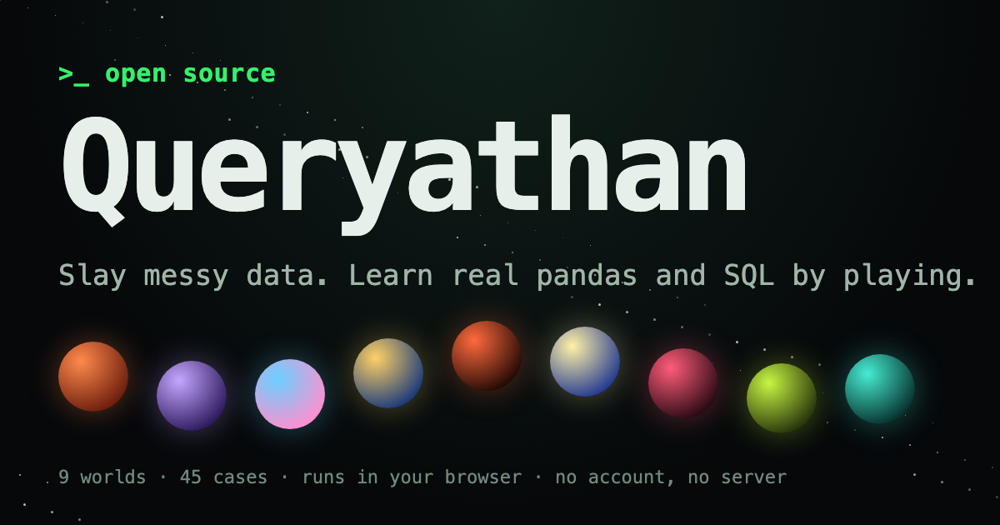
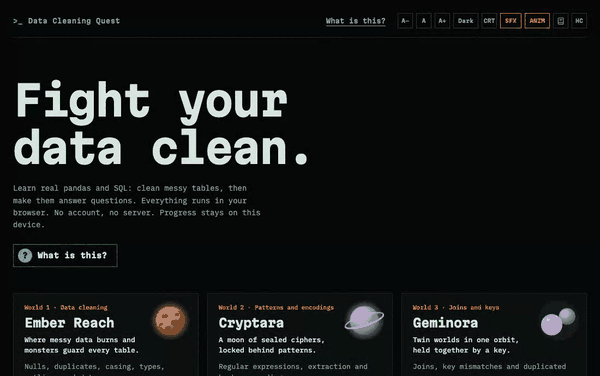
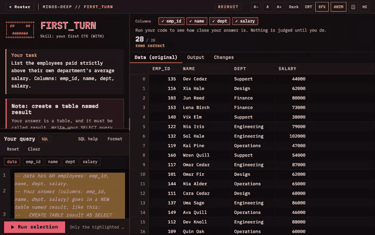
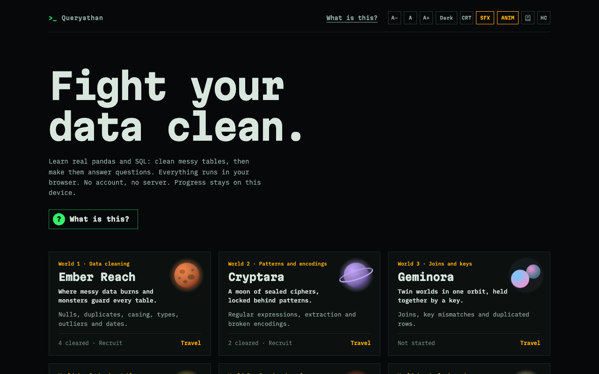
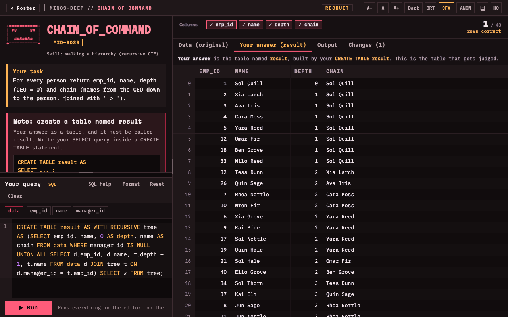
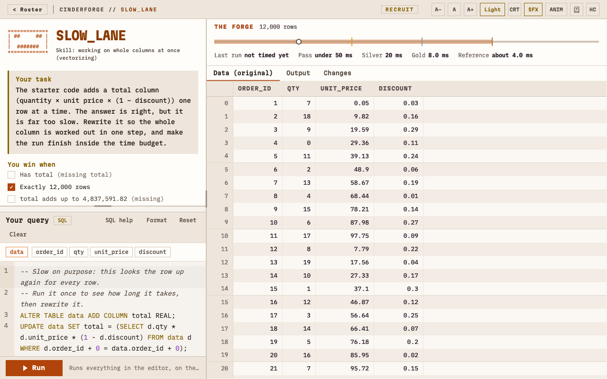
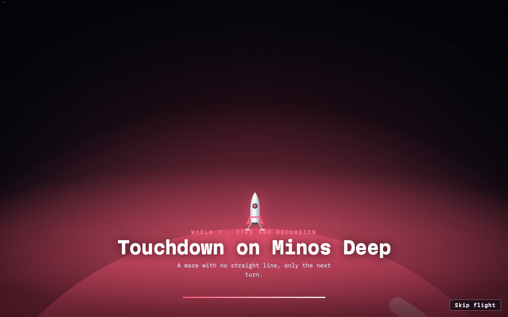

<div align="center">



# Queryathan

**Slay messy data. Learn real pandas and SQL by playing: nine planet worlds, 45 cases, real engines in your browser.**
No account. No server. Nothing to install. Works offline.

[](https://github.com/Yuvakunaal/queryathan/actions/workflows/ci.yml)
[](https://github.com/Yuvakunaal/queryathan/actions/workflows/codeql.yml)
[](./LICENSE)
[](./CONTRIBUTING.md)
[](https://github.com/Yuvakunaal/queryathan/labels/good%20first%20issue)


[Play](#quick-start) · [The nine worlds](#the-nine-worlds) · [How it works](#how-it-works) · [Contribute](#contributing) · [FAQ](#faq)

</div>

---

_Queryathan_ is _query_ + _leviathan_: the great beast of messy data, and the queries you fight it with.

Most people learn data work from tidy tutorials, then meet a real table and freeze. Queryathan
flips that: every case is a **messy table with a real problem in it**, and you fix it by writing **real
pandas or real SQL**, running it against a **real engine in your browser**, and watching the table change. Win
a case and a short cinematic plays. Travel to the next world by rocket.

<p align="center">
  
  
</p>

## Why it is different

|                        | Typical tutorials       | Queryathan                                                              |
| ---------------------- | ----------------------- | ----------------------------------------------------------------------- |
| **Code runs**          | On a server, or faked   | In your browser: Pyodide (pandas) and SQLite (WebAssembly)              |
| **Languages**          | One                     | **Both**: every case is winnable in Python and in SQL                   |
| **Checking**           | Match the expected code | Judge the **result**: any correct approach wins                         |
| **Errors**             | Hidden or generic       | The real error, with a plain-English explanation on top                 |
| **Account / tracking** | Required                | None. Progress stays on your device and exports as a file               |
| **Offline**            | No                      | Yes, after one visit                                                    |
| **Content**            | Locked in a platform    | Open: a case is one JSON file and a CC0 dataset                         |
| **Accessibility**      | Rarely audited          | Dark, light, high contrast, keyboard, reduced motion, WCAG audits in CI |

## The nine worlds

Each world is a planet with its own colours, heads-up display and theme. Choosing one launches a rocket flight
(skippable, and optional in the **ANIM** menu).

| #   | World           | You practise                                                                                    | Cases |
| --- | --------------- | ----------------------------------------------------------------------------------------------- | ----- |
| 1   | **Ember Reach** | Cleaning: nulls, duplicates, whitespace and casing, wrong types, outliers, bad dates            | 4     |
| 2   | **Cryptara**    | Patterns: regular expressions, extraction, broken text encodings                                | 5     |
| 3   | **Geminora**    | Joins: key mismatches, repeated rows, joining two to four tables                                | 6     |
| 4   | **Atlas Spire** | Reshaping: melt, pivot, nested JSON                                                             | 4     |
| 5   | **Cinderforge** | Speed: vectorising, window functions, timed against a stopwatch (bronze, silver, gold stamps)   | 2     |
| 6   | **Lumenfield**  | Analysis: grouping, ranking, moving averages, cohorts, sessions, funnels                        | 6     |
| 7   | **Minos Deep**  | CTEs and recursion: `WITH`, anti-joins, org charts, bills of materials, set logic, streaks      | 6     |
| 8   | **Chronopolis** | Time: mixed date formats, business days, time zones, date spines, as-of joins, interval merging | 6     |
| 9   | **Helix-9**     | Statistics: spread, z-score outliers, imputation, binning, A/B tests, regression                | 6     |

There is also a **Sandbox**: load your own CSV (up to four tables, joined in a rearrangeable collage) and
explore it with pandas or SQL. Nothing is uploaded.

<p align="center">
  
  
</p>
<p align="center">
  
  
</p>

## Quick start

You need [Node](https://nodejs.org) (the version in [`.nvmrc`](./.nvmrc)) and [pnpm](https://pnpm.io) (via Corepack).

```bash
git clone https://github.com/Yuvakunaal/queryathan.git
cd queryathan
corepack enable
pnpm install      # also fetches the pinned, checksum-verified Pyodide runtime (~14 MB)
pnpm dev          # http://localhost:5173
```

| Command                 | What it does                                                                                     |
| ----------------------- | ------------------------------------------------------------------------------------------------ |
| `pnpm dev`              | Run the app locally                                                                              |
| `pnpm build`            | Type-check and build the production bundle                                                       |
| `pnpm typecheck`        | `tsc -b` across the whole workspace                                                              |
| `pnpm lint`             | ESLint (strict, type-aware)                                                                      |
| `pnpm test`             | Unit tests (Vitest)                                                                              |
| `pnpm validate-content` | Check every case and roster against the schema                                                   |
| `pnpm e2e`              | Build, then run the Playwright suite against the production build with the real security headers |

First e2e run: `pnpm --filter @dcq/web exec playwright install chromium`.

## How it works

```
 case JSON  ──►  declarative win predicates (trusted code judges; the JSON never runs)
    │
    ▼
 React 19 UI ◄──typed messages──►  Web Worker: Pyodide (pandas)   or   Web Worker: sql.js (SQLite)
    │                                  one persistent session per fight, like a notebook
    ▼
 GSAP animation (outside React's render loop), CodeMirror 6 editor, virtualised data grid
```

- **Content is data.** A case is one JSON file plus a small synthetic dataset. Adding one needs no engine knowledge.
- **Answers are verified three ways.** The expected table is computed in plain JavaScript from the briefing, then real SQL and real pandas must each reach it.
- **Safe by construction.** User code only ever runs inside a Web Worker, behind a strict Content-Security-Policy. See [`SECURITY.md`](./SECURITY.md).

## Quality

- Strict TypeScript, ESLint, Prettier, Husky pre-commit, CodeQL, Dependabot.
- 298 unit tests (Vitest) and 300+ end-to-end tests (Playwright) on a production build served with the real headers:
  every case in both engines, near-miss wrong answers, every complete SQL hint, offline use, layout at phone widths,
  axe-core accessibility scans in both themes, and WCAG AA contrast on every colour token.
- Lighthouse budgets in CI.

## Contributing

**A new case is a JSON file plus a dataset.** No engine knowledge needed. Start with
[`CONTRIBUTING.md`](./CONTRIBUTING.md), the [authoring guide](./docs/content-authoring-guide.md) and the
[call for cases](./docs/call-for-cases.md). Looking for something small to start with? See the
[good first issues](./docs/good-first-issues.md). Bigger changes (a new world, a schema change) start with a short
[RFC](./docs/rfc-template.md) in Discussions. Please read the [Code of Conduct](./CODE_OF_CONDUCT.md).

## Roadmap

- [x] Nine worlds, 45 cases, both engines, sandbox, offline, themes, accessibility audits
- [x] Rocket flights and cinematic wins (optional)
- [ ] More cases in every world ([wanted list](./docs/call-for-cases.md))
- [ ] Firefox and WebKit in the end-to-end matrix
- [ ] Interface and briefings in more human languages
- [ ] Teacher mode: print-friendly case sheets and answer keys (still no accounts)

Out of scope on purpose: accounts, streaks, leaderboards, cloud sync and tracking. See [`docs/ROADMAP.md`](./docs/ROADMAP.md).

## FAQ

**Is it really running Python in my browser?** Yes. [Pyodide](https://pyodide.org) is CPython and pandas compiled to WebAssembly. SQL runs in [sql.js](https://sql.js.org), SQLite compiled to WebAssembly.

**Does it work offline?** After one visit, yes. The first Python start downloads pandas once (pinned version) and caches it.

**Where is my progress stored?** In your browser's `localStorage`, on your device only. Export it as a file to move it. There is no server to sync with.

**Is it safe to run code I type?** It runs in a Web Worker with no access to the page, behind a strict CSP, with a run timeout. See [`SECURITY.md`](./SECURITY.md).

**Can I use it in a class or a workshop?** Yes, it is MIT licensed and needs no accounts. Deploy it as a static site (see [`vercel.json`](./vercel.json) for the required headers).

**Why SQLite and not MySQL or Postgres?** It is the engine that runs in a browser. The app adds many friendly functions (`DATEDIFF`, `STDDEV`, `REGEXP_REPLACE`, ...) and explains dialect differences in plain language.

**Can I add my own cases?** That is the point. See [Contributing](#contributing).

## Documentation

[Architecture](./docs/ARCHITECTURE.md) · [Authoring guide](./docs/content-authoring-guide.md) ·
[Decision records](./docs/adr/) · [Roadmap](./docs/ROADMAP.md) · [Changelog](./CHANGELOG.md) ·
[Support](./SUPPORT.md) · [Original product plan](./queryathan-master-plan.md)

## Stack

React 19 · TypeScript (strict) · Vite · Pyodide · sql.js · CodeMirror 6 · GSAP · TanStack Virtual · Zod · Vitest · Playwright · pnpm workspaces

## Security

This app runs code typed by the player. See [`SECURITY.md`](./SECURITY.md) for the sandboxing model, the CSP
and how to report a vulnerability.

## Acknowledgements

Built on the shoulders of [Pyodide](https://pyodide.org), [sql.js](https://sql.js.org),
[pandas](https://pandas.pydata.org), [SQLite](https://sqlite.org), [CodeMirror](https://codemirror.net),
[GSAP](https://gsap.com), [TanStack Virtual](https://tanstack.com/virtual) and [React](https://react.dev).
All datasets are synthetic and released under CC0.

## License

[MIT](./LICENSE) for the code. Datasets are CC0.

<div align="center">

If this helped you, a star on GitHub helps others find it.

[](https://star-history.com/#Yuvakunaal/queryathan&Date)

</div>
